# Exploring the Solar System

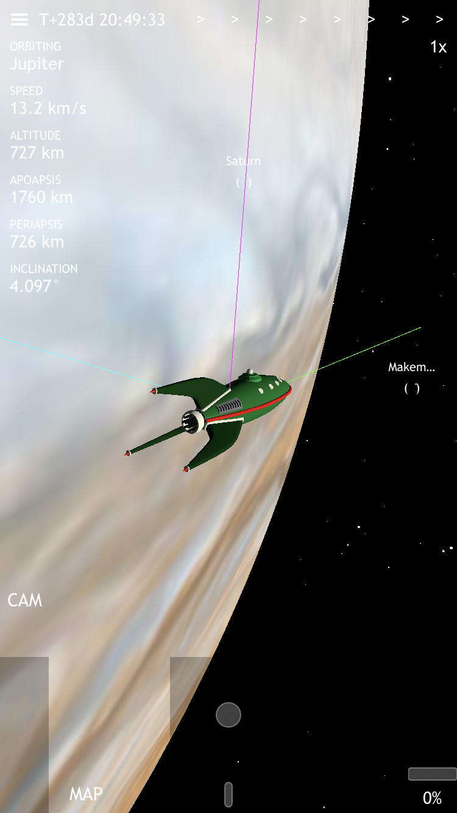
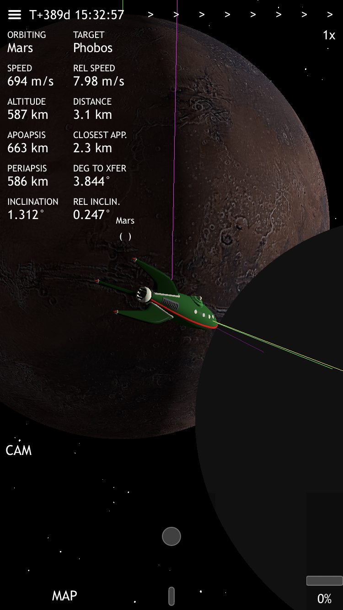
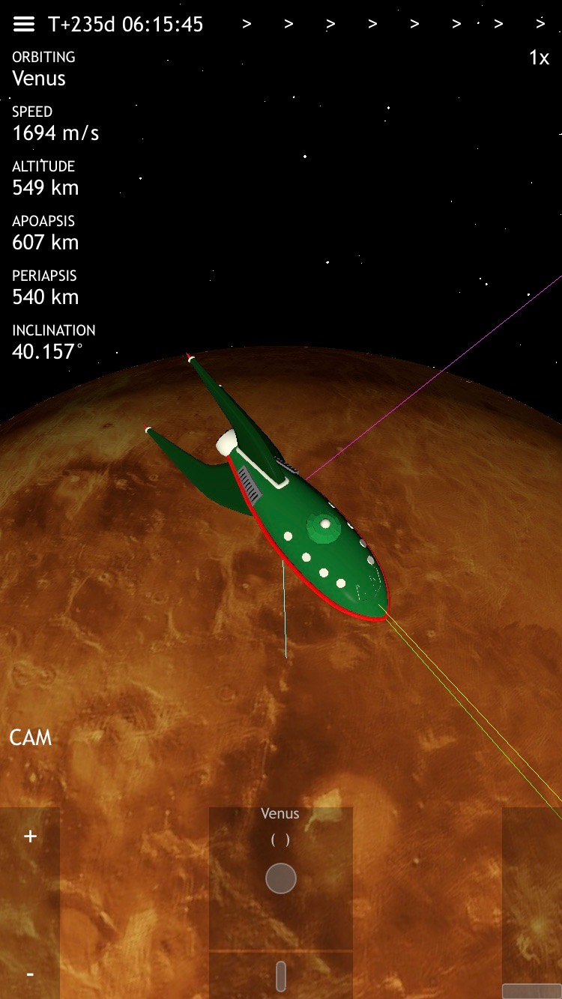

# Rendezvous with the ISS

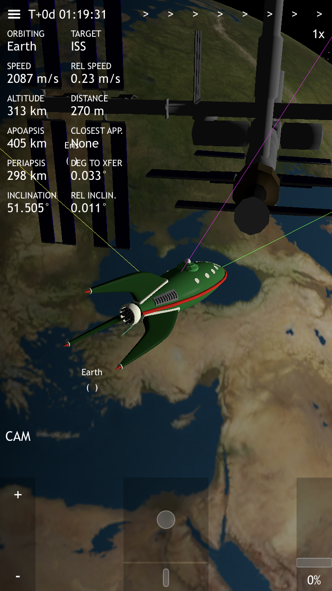

# A Trip to the Moon

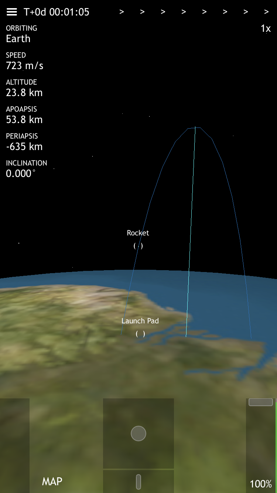
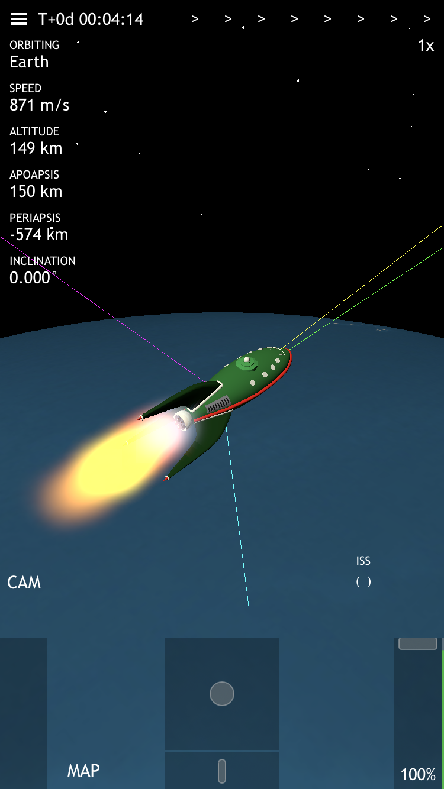
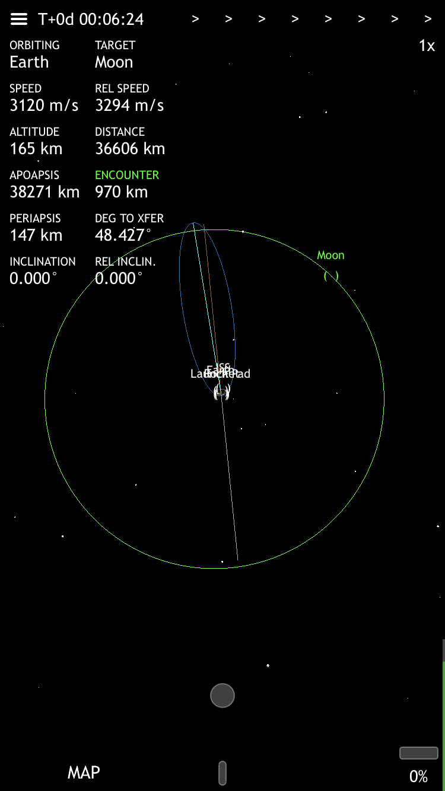

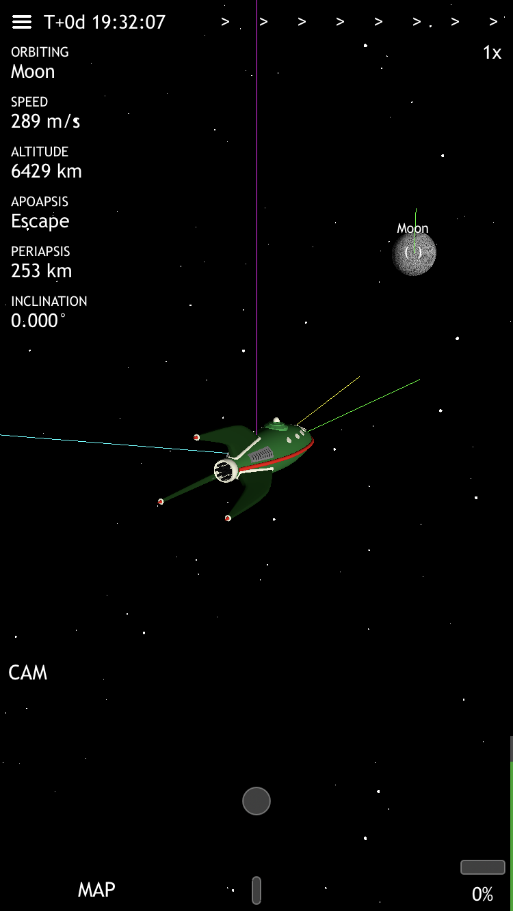
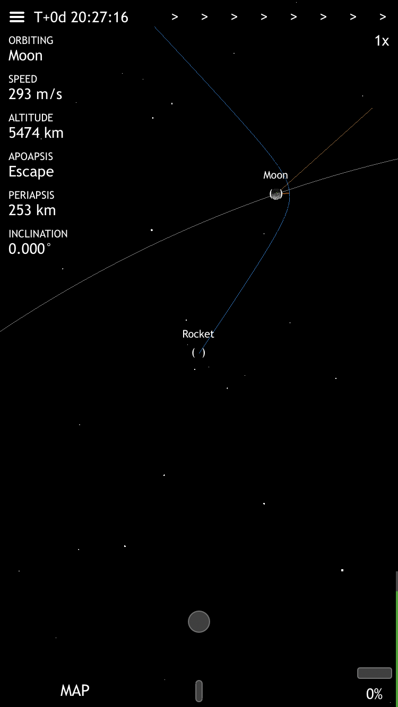
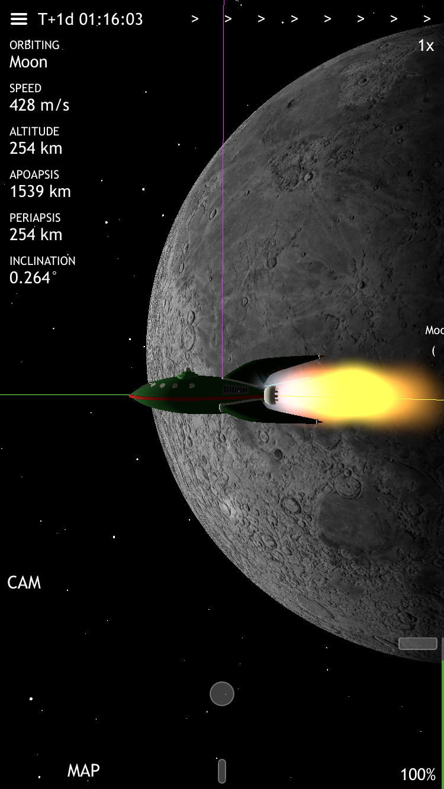
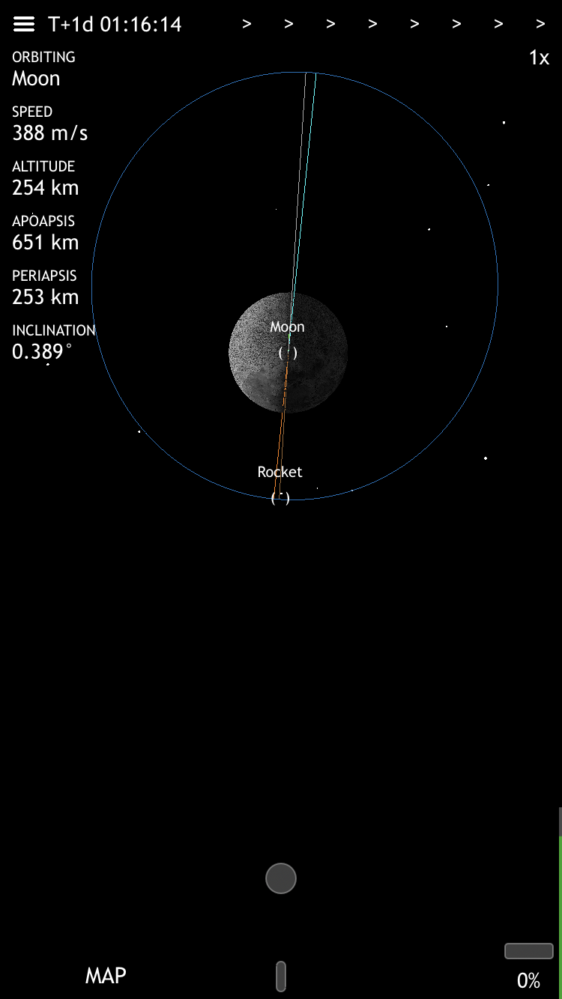

# So, how do I fly?

The throttle is the bar on the right. Slide it up to turn on the engine.

As you use up your propellant, you can see the gauge on the right side of the throttle dropping.

The control stick is the dot in the middle. Move it to pitch up and down or yaw left and right.

The roll control stick is the thin bar below the main control stick. Move it left and right to roll around.

You can pan the camera around the rocket by touching the screen.

You can pinch to zoom in and out, in order to see your orbit. The unlabeled slider on the left is also a zoom slider, so you can zoom one-handed.

You can also use the "MAP" button to quickly toggle between your rocket and a zoomed-out view.

The "CAM" button switches the rocket camera between "ground view" (where up is perpendicular to the planet) and "orbit view" (where up is perpendicular to the plane of the solar system). You might want to switch this once you get into orbit.

The time warp control is on the upper right. The first arrow is 1x, then the next is 5x, then the rest are 100x and higher (warp mode). You can only go into higher warp modes when you're far enough from the planet you're orbiting.

Use the menu in the upper left to restart the simulated world whenever you want.

# What's up with the lines?

Instead of a navball, the orbital navigation uses a "heads-up display" centered on your rocket. 

The ship is pointing towards the green line. Depending on what you want to do, you can rotate your ship to line it up with one of these other vectors:

* Your prograde velocity vector is the yellow line (use this to raise or lower your apoapsis or periapsis!)
* The normal vector is magenta (use this for plane changes!)
* The radial vector is turquoise (use this to rotate your orbit!).

If you want to burn retrograde, anti-normal, or anti-radial, just point the back of your ship toward the line instead.

Each body also has a "heads-up display" label, so you can see where it is even when it's too far to actually see. When you've tapped a body to make it your target, you can see the target vector as a purple line as well.

When you're within 35km of a planet or moon, the yellow velocity vector automatically switches so it's relative to the rotating surface. This helps you land.

When you're within 35km of a non-planet target like the ISS, the yellow velocity vector automatically switches so it's relative to the target. This helps with your rendezvous, so you can cancel out your relative velocity and go the same speed as the target.

# Orbit Map

The orbits are gray, your orbit is blue, and your target's orbit is green.

Your apoapsis is shown with a cyan line, and your periapsis is shown with an orange line.

The ascending node line is gray, and the descending node line is brown.

Maybe I'll do markers instead at some point, but the lines are pretty clear once you get used to the colors.

# Going deeper

There are currently 3 training missions that you can use to practice getting into orbit.

And, you can try following Kerbal Space Program tutorials and videos too. Rest assured, it all works pretty much the same way in Planet Express.

There's still so much more to build (saving your game, refueling, missions, real terrain, real sky, aerodynamics, RCS, etc) but I've spent many hours flying around the solar system already.

Plus, it's optimized for playing one-handed in portrait mode, so you can play it while you ride the train!

